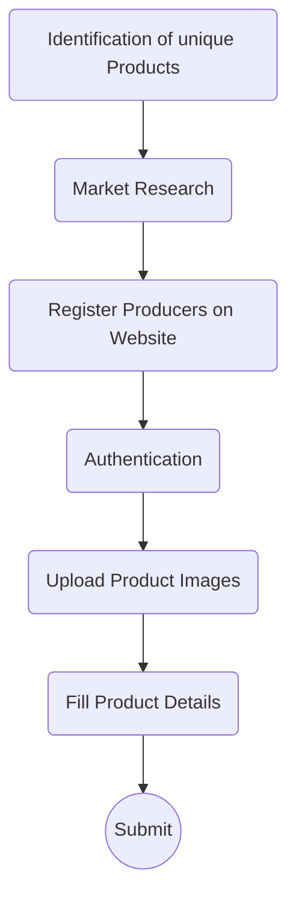
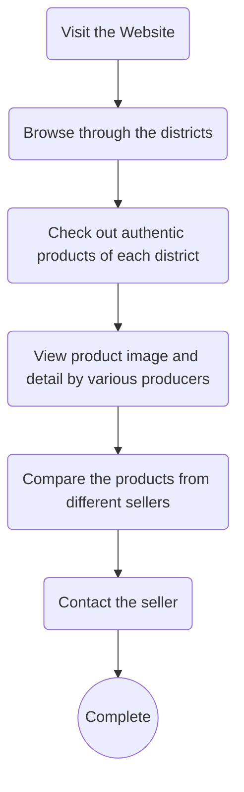

## One District One Product
The One District One Product (ODOP) initiative is a unique program designed to promote the distinctive products that each district of Jammu and Kashmir excels in. It aims to support local artisans and producers, uplift local economies, and preserve traditional craftsmanship.

In our specific implementation of the ODOP project, the primary objective of the platform is to cut out intermediaries from the supply chain, enabling producers to receive fair remuneration for their products while giving consumers access to a diverse range of authentic ODOP items.

## Getting Started
To get started with our ODOP project, you don't need to install any software. It's an online platform that can be accessed from your web browser.

## Prerequisites
The ODOP project is accessible through a web browser, so you only need an internet connection to get started. There are no specific software or hardware prerequisites for using the project.

## Installation

As mentioned earlier, there's no installation required for our ODOP project. It is a web-based platform, and you can access it directly by visiting project website.

## Usage/Examples

Producers POV:
1. Visit the official odop website.
2. Register themselves on the website.
3. Complete authentication by providing their unique agricultural license number.
4. Upload the product images and other relevant details and descriptions like.
5. Finally submit the product and let people know about their unique products.

Consumers POV:
1. Visit the official odop website.
2. Explore the diverse range of ODOP products showcased on the platform.
3. Click on individual product listings to read about the artisans who create them, their stories, and the unique characteristics of each products.


```npm start```
```npm test```
```npm run build```

##Screenshots


##Flowcharts

###Producer POV



###Consumer POV


